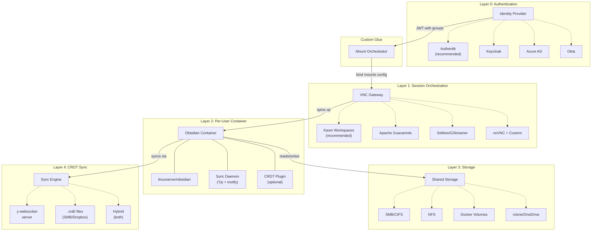
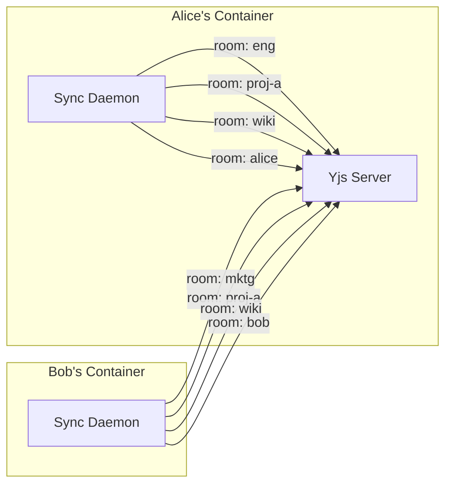
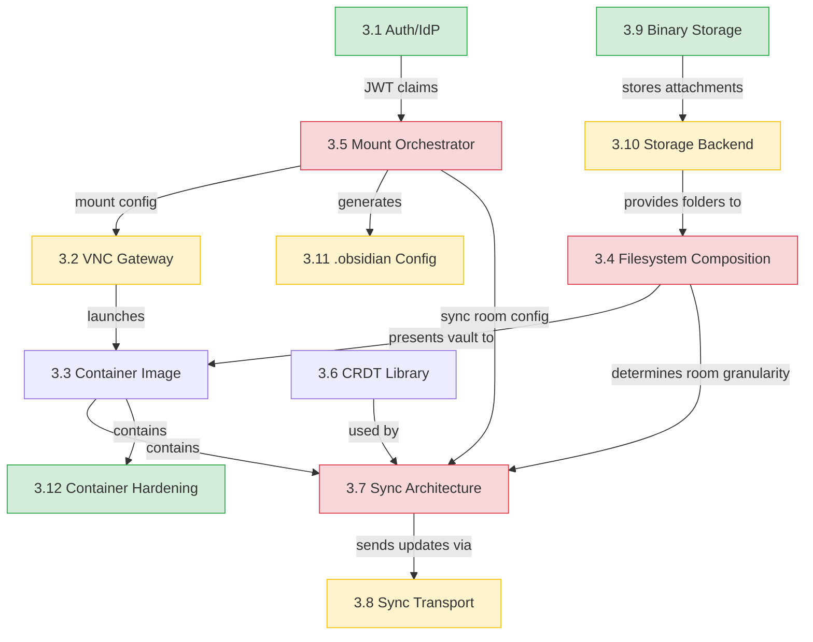
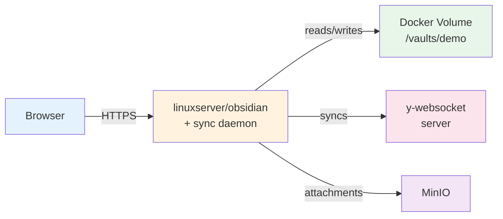
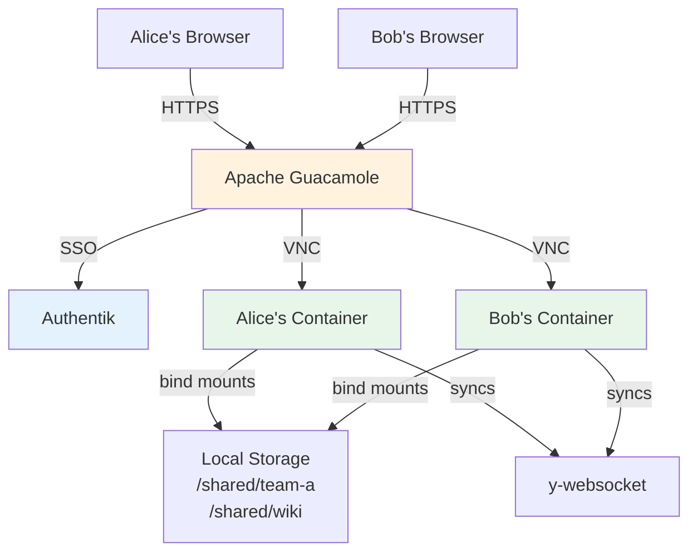
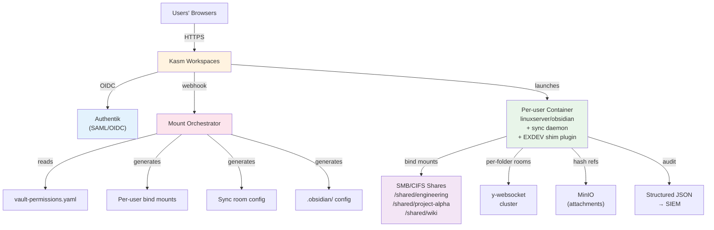
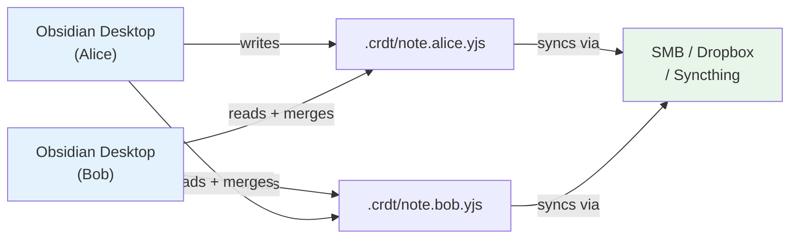
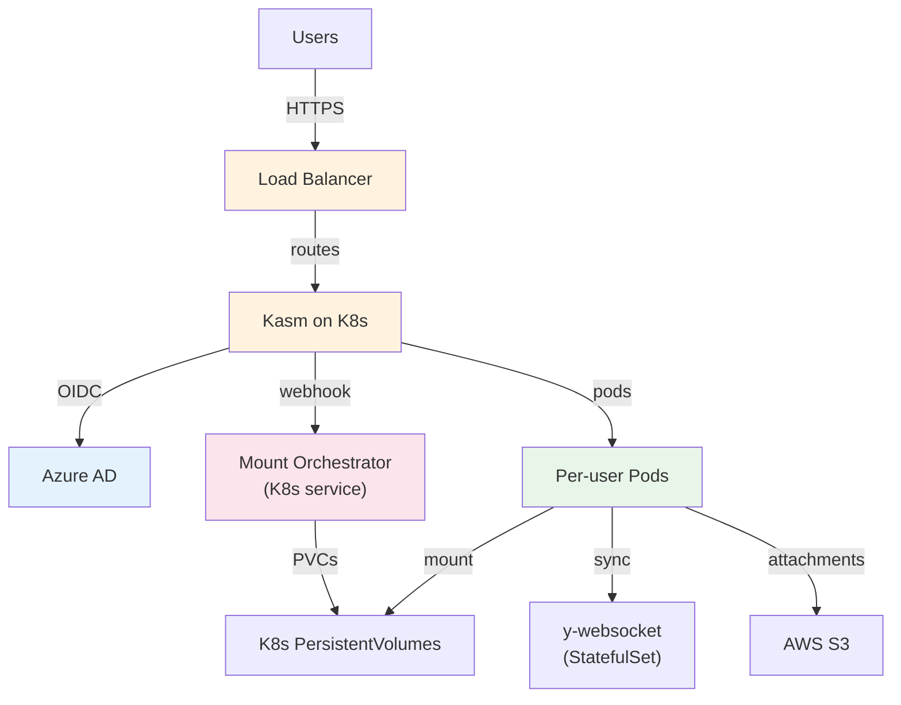

# Architecture Components Analysis

Comprehensive catalog of every architectural building block in the obsidian-in-the-browser system, how they connect, which can be swapped, and the tradeoffs involved.

---

## Table of Contents

1. [Executive Summary](#1-executive-summary)
2. [System Overview](#2-system-overview)
3. [Component Catalog](#3-component-catalog)
4. [Dependency Matrix](#4-dependency-matrix)
5. [Known Architectural Problems](#5-known-architectural-problems)
6. [Reference Architectures](#6-reference-architectures)
7. [Decision Coupling Analysis](#7-decision-coupling-analysis)
8. [Cost-Benefit Summary](#8-cost-benefit-summary)
9. [Implementation Phasing](#9-implementation-phasing)
10. [Appendix](#10-appendix)

---

## 1. Executive Summary

This document catalogs **12 component categories** across **5 architectural layers**. Each component has multiple options that can be mixed and matched, subject to coupling constraints documented in Section 4.

**How to use this document:**
- Starting fresh? Read Section 6 (Reference Architectures) first — pick the config closest to your needs
- Evaluating a specific component? Jump to its subsection in Section 3
- Understanding constraints? Read Section 5 (Known Problems) and Section 7 (Decision Coupling)
- Planning work? See Section 9 (Implementation Phasing)

**Key architectural insight:** RBAC is enforced at folder-mount level via composite bind mounts. Each user gets a personalized vault assembled from authorized folders. This is the central design decision that shapes most other choices.

---

## 2. System Overview

### Master Architecture



### Two Deployment Modes

| Mode | Target | Infrastructure | Components Used |
|------|--------|---------------|-----------------|
| **Full Enterprise** | Web-based access, real-time collab, RBAC | VNC gateway, containers, auth, sync server | All layers |
| **Plugin-Only** | SMB/cloud sync conflict resolution | None (just install the plugin) | Layer 4 only (file-based) |

### Key Architectural Constraints

1. **Obsidian opens one vault at a time** — no cross-vault linking, search, or graph
2. **Obsidian requires a real filesystem** — can't run natively in browser (hence VNC)
3. **Linux `rename()` fails across mount boundaries** — EXDEV error on cross-folder moves
4. **Electron requires HTTPS** — can't serve Obsidian over plain HTTP
5. **Organizational permissions are a graph, not a tree** — the filesystem forces hierarchy

---

## 3. Component Catalog

### 3.1 Authentication / Identity Provider

**Role:** Authenticate users and provide group membership claims via JWT/OIDC tokens.

**Interface:**
- Consumes: User credentials, LDAP/AD group sync
- Produces: JWT with `sub`, `groups[]`, `email`, `name`
- Depended on by: Mount Orchestrator, VNC Gateway

| Option | Cost | Complexity | Security | UX | Scalability | Maturity | Lock-in |
|--------|------|------------|----------|----|-------------|----------|---------|
| **Authentik** | Free (OSS) | Medium | High (OIDC/SAML/LDAP) | Good | High | Medium | Low |
| **Keycloak** | Free (OSS) | High | Very High | Fair | Very High | High | Low |
| **Azure AD** | Included w/ M365 | Low (if already MS) | Very High | Good | Very High | Very High | High (MS) |
| **Okta/OneLogin** | $$$ SaaS | Low | Very High | Good | Very High | Very High | Medium |

**Recommended:** Authentik for self-hosted; Azure AD if already a Microsoft shop.
**Decision status:** Pending (see [[decision-log]])
**Independence:** Highly independent — any OIDC-compliant IdP works. Only coupled to JWT claim format.

---

### 3.2 VNC Gateway / Session Orchestration

**Role:** Provide browser-based access to Obsidian desktop, manage per-user container sessions.

**Interface:**
- Consumes: Auth tokens, container images, mount configurations
- Produces: Browser-accessible VNC/WebRTC stream per user
- Depended on by: End users (browser access)
- Depends on: Auth (SSO integration), Mount Orchestrator (mount config)

| Option | Cost | Complexity | Security | UX | Scalability | Maturity | Lock-in |
|--------|------|------------|----------|----|-------------|----------|---------|
| **Kasm Workspaces** | Free CE / $$$ Enterprise | Medium-High | High (SSO, DLP, isolation) | Good (session mgmt) | High (K8s support) | High | Medium |
| **Apache Guacamole** | Free (OSS) | Medium | Medium | Fair (basic UI) | Medium (manual) | High | Low |
| **Selkies/GStreamer** | Free (OSS) | High | Medium | Best (WebRTC, low latency) | Medium | Medium | Low |
| **noVNC + Custom** | Free (OSS) | Very High | Low (DIY security) | Fair | Low (manual) | High (noVNC) | None |

**Recommended:** Kasm for enterprise; Guacamole for POC/small teams.
**Decision status:** Pending — evaluating (see [[decision-log]])

**Key findings from troubleshooting:**
- `shm_size: "1gb"` is critical — prevents black screens/crashes in Electron
- `security_opt: seccomp:unconfined` — needed for keyboard/hotkey handling
- HTTPS is mandatory (Electron hard requirement, no bypass)
- `HARDEN_OPENBOX` breaks `NO_DECOR` auto-maximize behavior
- `PIXELFLUX_WAYLAND: "true"` improves VNC performance (experimental)
- Browser intercepts hotkeys before they reach Obsidian (fundamental VNC limitation)

See [[VNC_TROUBLESHOOTING_FINDINGS]] for full details.

---

### 3.3 Container Base Image

**Role:** Run Obsidian desktop app with VNC server and sync daemon inside a Docker container.

**Interface:**
- Consumes: Bind mounts (vault folders, .obsidian config), environment variables
- Produces: VNC stream (port 3000/3001), sync daemon API (port 3001)
- Depends on: Storage backend (mounts), VNC gateway (session management)

| Option | Cost | Complexity | Security | UX | Scalability | Maturity | Lock-in |
|--------|------|------------|----------|----|-------------|----------|---------|
| **linuxserver/obsidian** | Free | Low | Medium | Good (Selkies built-in) | High | High | Low |
| **Custom Dockerfile** | Free | High | Configurable | Variable | High | Low (your code) | None |

**Recommended:** linuxserver/obsidian — well-maintained, Selkies VNC built in, community support.
**Current implementation:** `docker/obsidian-kasm/Dockerfile` extends linuxserver/obsidian with sync daemon.

---

### 3.4 Filesystem Composition Strategy

**Role:** Present multiple permission-scoped folders as a single Obsidian vault.

This is the most architecturally significant decision. See [[UNION_FILESYSTEMS_EXPLORATION]] for the full analysis.

**Interface:**
- Consumes: Source folders from shared storage, per-user config
- Produces: A single `/vault/` directory that Obsidian opens
- Depends on: Storage backend, Mount Orchestrator
- Depended on by: CRDT sync (determines room granularity), Obsidian (UX)

| Option | Cost | Complexity | Security | UX | Scalability | Maturity | Lock-in |
|--------|------|------------|----------|----|-------------|----------|---------|
| **A: Docker bind mounts** | Free | Low | Strong (kernel) | Good (EXDEV breaks moves) | High | Very High | None |
| **B: MergerFS** | Free | Medium | Medium (FUSE) | Good (cross-move works) | Medium | High | Low |
| **C: Symlinks** | Free | Low | Weak | Fair | High | Very High | None |
| **D: OverlayFS** | Free | Medium | Strong (kernel) | Broken (CoW breaks sharing) | N/A | Very High | N/A |
| **E: Custom FUSE** | Free | Very High | Maximum | Best | Medium | None (custom) | High |
| **F: Bind mounts + EXDEV shim** | Free | Medium | Strong (kernel) | Good | High | High | Low |

**Recommended:** **Option F — Bind mounts + EXDEV shim plugin/daemon.**
- Kernel-enforced security from bind mounts
- Plugin or daemon catches `EXDEV` errors and does copy+delete fallback
- Best balance of security, simplicity, and compatibility

**Rejected:** Option D (OverlayFS) — copy-on-write semantics mean edits go to per-user upper layer, not shared source. Other users never see changes. Fundamentally incompatible with shared editing.

**How it looks per user:**
```
/vault/                          <- Obsidian opens this
├── .obsidian/                   <- Per-user config (bind mount)
├── _inbox/                      <- Writable root-level folder
├── engineering/                 <- Bind mount from /shared/engineering
├── project-alpha/               <- Bind mount from /shared/project-alpha
├── wiki/                        <- Bind mount from /shared/wiki (read-only)
└── personal/                    <- Bind mount from /users/alice/personal
```

---

### 3.5 Mount Orchestrator (Custom Glue Service)

**Role:** The central "glue" that translates user identity + group memberships into per-user Docker mounts, .obsidian config, and sync room config.

**Interface:**
- Consumes: JWT claims (user, groups), `vault-permissions.yaml`
- Produces: Docker bind mount list, per-user `.obsidian/` config, sync daemon config
- Depends on: Auth (JWT), Storage backend (mount sources)
- Depended on by: VNC Gateway (container launch), Sync daemon (room config)

This is custom software — no off-the-shelf alternative exists. It integrates via:
- **Kasm:** Server-side startup script or webhook on session create
- **Guacamole:** Connection pre-hook script
- **Custom:** Direct Docker API calls

**Key logic:**
```
User logs in → JWT extracted → groups = [engineering, project-alpha, all-employees]
  → vault-permissions.yaml lookup
  → mounts = [/shared/engineering, /shared/project-alpha, /shared/wiki, /users/alice/personal]
  → generate Docker run command with those bind mounts
  → generate .obsidian/ config with valid paths for mounted folders
  → generate sync daemon config with per-folder room mappings
```

**Implementation status:** Pending. See `01-working/mount-orchestration.md`.

---

### 3.6 CRDT Library

**Role:** Provide conflict-free replicated data types for text synchronization.

**Interface:**
- Consumes: Text edits (insertions, deletions)
- Produces: Mergeable state that resolves conflicts automatically
- Used by: Sync daemon, Obsidian plugin

| Option | Cost | Complexity | Security | UX | Scalability | Maturity | Lock-in |
|--------|------|------------|----------|----|-------------|----------|---------|
| **Yjs** | Free | Low | N/A | Good | High | Very High (Notion, Figma) | Low |
| **Automerge** | Free | Medium | N/A | Good | High | High | Low |
| **Loro** | Free | Medium | N/A | Good | Medium | Low (newer) | Low |
| **OctoBase** | Free | High | N/A | Good | Medium | Low (AFFiNE-specific) | Medium |

**Chosen:** Yjs — DECISION-001. Battle-tested, excellent TypeScript support, y-websocket transport, awareness protocol for presence.

**Key learnings from Relay plugin:** Obsidian's file cache causes timing issues where the plugin sees stale data. Solution: diff-match-patch for file-on-disk reconciliation, or external daemon that reads after Obsidian finishes writing.

---

### 3.7 Sync Architecture

**Role:** Detect file changes and propagate them via CRDT.

**Interface:**
- Consumes: Filesystem events (inotify/chokidar), Obsidian API events
- Produces: CRDT updates sent to sync transport
- Depends on: CRDT library, sync transport

| Option | Cost | Complexity | Security | UX | Scalability | Maturity | Lock-in |
|--------|------|------------|----------|----|-------------|----------|---------|
| **External daemon** | Free | Medium | High (isolated) | Good (slight delay) | High | Medium (our code) | Low |
| **Obsidian plugin** | Free | Medium | Medium (can crash app) | Best (instant) | Medium | Medium (our code) | Low |
| **Hybrid** | Free | High | High | Best | High | Medium | Low |

**Chosen:** External daemon as primary + optional plugin for presence/UX (DECISION-003).

**Why daemon over plugin:**
- Obsidian's internal file cache creates timing issues (sees stale data)
- Plugin crash = Obsidian crash
- Daemon reads directly from filesystem after `CLOSE_WRITE` events
- Plugin provides optional enhancements: presence awareness, nudge suggestions

**Critical change for composite vaults:** Must use **per-folder CRDT rooms**, not per-vault:



Alice and Bob share rooms `proj-a` and `wiki` but have separate rooms for their department and personal content.

---

### 3.8 Sync Transport

**Role:** Move CRDT updates between instances.

**Interface:**
- Consumes: CRDT update messages
- Produces: Delivered updates to other clients
- Depends on: Network or file sync infrastructure

| Option | Cost | Complexity | Security | UX (latency) | Scalability | Maturity | Lock-in |
|--------|------|------------|----------|--------------|-------------|----------|---------|
| **y-websocket server** | Free + infra | Low | High (WSS) | Best (<1s) | High (clusterable) | High | Low |
| **File-based (.crdt/)** | Free | Low | Medium | Poor (minutes) | Low | Medium (our code) | None |
| **Hybrid** | Free + infra | Medium | High | Best (fallback) | High | Medium | Low |

**Recommended:** Hybrid — y-websocket primary for real-time, file-based fallback for offline/disconnected scenarios (DECISION-004).

**File-based mode details:**
- State stored as `.crdt/{path}.{clientId}.yjs` (DECISION-006)
- Each client owns one file — no write conflicts on SMB/Dropbox
- On file open: merge all `.yjs` files for that note
- On file save: write own state file
- Sync latency depends on file sync speed (SMB/Dropbox/Syncthing)

---

### 3.9 Binary/Attachment Storage

**Role:** Handle images, PDFs, and other non-text files that CRDTs can't efficiently sync.

**Interface:**
- Consumes: Binary files from vault `_attachments/`
- Produces: Content-addressable references (`sha256:abc123`)
- Depends on: Object storage backend

| Option | Cost | Complexity | Security | UX | Scalability | Maturity | Lock-in |
|--------|------|------------|----------|----|-------------|----------|---------|
| **MinIO** | Free (self-hosted) | Medium | High | Good | High | Very High | Low (S3 API) |
| **AWS S3** | $ pay-per-use | Low | Very High | Good | Very High | Very High | Medium |
| **Inline in vault** | Free | None | N/A | Perfect | Low (CRDT bloat) | N/A | None |
| **Hash-referenced** | Free + storage | Medium | High | Good | High | Medium | Low |

**Chosen:** Hash-referenced in MinIO (DECISION-005). Only the hash reference syncs via CRDT; actual bytes stored once in object storage. Prevents CRDT state explosion from large binaries.

---

### 3.10 Storage Backend

**Role:** Persistent storage for vault content (the source of truth that bind mounts point to).

**Interface:**
- Consumes: File operations from Obsidian containers
- Produces: Persistent, shared filesystem accessible by multiple containers
- Depended on by: Filesystem composition, CRDT sync, backups

| Option | Cost | Complexity | Security | UX | Scalability | Maturity | Lock-in |
|--------|------|------------|----------|----|-------------|----------|---------|
| **Docker volumes** | Free | Very Low | Medium | Good | Low (single host) | Very High | Low |
| **SMB/CIFS** | Free (existing) | Medium | High (AD-integrated) | Good | High | Very High | Low |
| **NFS** | Free | Medium | Medium | Good (fast) | High | Very High | Low |
| **rclone/OneDrive** | Included w/ M365 | High (FUSE) | High | Fair (latency) | Very High | Medium | High (MS) |
| **Local disk** | Free | None | Low | Best (fastest) | None | N/A | None |

**Recommended:** Docker volumes for POC, SMB/CIFS for enterprise (most have existing AD-integrated file servers).

---

### 3.11 `.obsidian/` Config Management

**Role:** Manage Obsidian settings, plugins, themes, and workspace state per user.

**Interface:**
- Consumes: Base config template, user overrides, list of mounted folders
- Produces: Per-user `.obsidian/` directory mounted into container
- Depends on: Mount Orchestrator (knows what's mounted)

| Option | Cost | Complexity | Security | UX | Scalability | Maturity | Lock-in |
|--------|------|------------|----------|----|-------------|----------|---------|
| **Fully per-user** | Free | Low | N/A | Best (full customization) | High | N/A | None |
| **IT-managed** | Free | Medium | High (controlled) | Poor (no customization) | High | N/A | None |
| **Layered (base + overrides)** | Free | Medium | High | Good | High | N/A | None |

**Recommended:** Layered — IT provides base config (approved plugins, themes, settings), users can override non-critical settings. Orchestrator patches path-dependent configs at session start.

**Path-dependent configs that need patching:**
- Templater: `template folder` path
- Daily Notes: folder path
- Dataview: silently returns partial results if folders are missing
- Workspace layouts: references to open files

---

### 3.12 Container Hardening / Selkies Configuration

**Role:** Lock down the containerized environment for enterprise single-application kiosk use.

See [[VNC_TROUBLESHOOTING_FINDINGS]] for the full Selkies variable reference.

**Critical settings (always use):**
```yaml
shm_size: "1gb"                    # Prevents Electron crashes
security_opt: seccomp:unconfined   # Keyboard handling
NO_DECOR: "true"                   # Remove window decorations
```

**Enterprise hardening (selective):**
```yaml
HARDEN_DESKTOP: "true"             # Disables tools, sudo, terminals
RESTART_APP: "true"                # Auto-restart if closed
SELKIES_FILE_TRANSFERS: "none"     # Disable file uploads/downloads
SELKIES_COMMAND_ENABLED: "false"   # Disable command execution
SELKIES_ENABLE_SHARING: "false"    # Disable sharing links
```

**Known bug:** `HARDEN_OPENBOX: "true"` breaks `NO_DECOR` auto-maximize behavior. Use `HARDEN_DESKTOP` without `HARDEN_OPENBOX` if you need both hardening and auto-maximize.

---

## 4. Dependency Matrix

### Component Dependency Graph



### Coupling Tiers

| Tier | Components | Meaning |
|------|-----------|---------|
| **Independent** (green) | Auth/IdP, Binary Storage, Container Hardening | Can be swapped with no impact on other components |
| **Loosely coupled** (yellow) | VNC Gateway, Storage Backend, Sync Transport, .obsidian Config | Soft dependencies — changing one may require config changes in others |
| **Tightly coupled** (red) | Filesystem Composition, Sync Architecture, Mount Orchestrator | Must be designed together — changing one forces changes in the others |

### Key Coupling Clusters

1. **Auth + VNC Gateway** — SSO integration method (OIDC callback URL, SAML config)
2. **Filesystem Composition + CRDT Sync Granularity** — per-folder rooms required for composite vault
3. **Filesystem Composition + EXDEV Handling** — bind mounts require shim plugin/daemon for cross-mount moves
4. **VNC Gateway + Mount Orchestrator** — how the orchestrator hooks into container launch lifecycle

---

## 5. Known Architectural Problems

### 5.1 Mounting/Permission Boundary Problem

**Severity:** Critical
**Affects:** Filesystem composition, UX, content organization

Obsidian opens one vault. Organizational permissions are a graph (cross-functional teams). The filesystem forces a tree. You can't represent matrix permissions in a single hierarchy.

**Solution:** Composite vault via bind mounts (Section 3.4). Each folder is an independent permission boundary, assembled per-user at session start. Users see one vault with only their authorized folders.

**Tradeoff accepted:** Content must be organized by access boundary, not conceptual taxonomy. If content belongs to both "engineering" and "project-alpha," it must live in one folder.

See [[MOUNTING_PERMISSION_BOUNDARY_PROBLEM]] for full analysis.

---

### 5.2 EXDEV Cross-Mount Move Problem

**Severity:** High
**Affects:** File moves between permission-scoped folders

Linux `rename()` syscall fails across filesystem boundaries with `EXDEV`. Node.js `fs.rename` does NOT automatically fall back to copy+delete — it throws. Users dragging files between folders in Obsidian will hit errors.

**Solution:** Obsidian plugin shim or daemon wrapper that catches `EXDEV` and performs `copyFile` + `unlink`.

**CRDT impact:** Cross-boundary moves appear as delete in one room + create in another. Correlation logic (same content hash + timing) can identify it as a move.

---

### 5.3 CRDT Sync Granularity

**Severity:** Architectural
**Affects:** Sync daemon design, Yjs server topology

Current design uses per-vault rooms. Composite vaults require **per-folder rooms** — each mounted folder syncs independently to users who have that folder.

**Solution:** Sync daemon config generated by Mount Orchestrator specifies folder-to-room mappings:
```yaml
sync:
  folders:
    - path: /vault/engineering
      room: folder-engineering
    - path: /vault/project-alpha
      room: folder-project-alpha
```

---

### 5.4 VNC UX Limitations

**Severity:** Medium
**Affects:** End-user experience

- **Hotkey conflicts:** Browser intercepts `Ctrl+T`, `Ctrl+N`, `F11`, etc. before they reach Obsidian. No env var fix — must remap Obsidian hotkeys to avoid conflicts.
- **HTTPS required:** Electron hard-codes HTTPS requirement. Need SSL certs even for local access.
- **Latency:** VNC adds ~50-200ms depending on network. Acceptable for text editing, noticeable for rapid navigation.
- **Auto-maximize:** Requires `NO_DECOR: "true"` but `HARDEN_OPENBOX` breaks it.

---

### 5.5 Container Lifecycle Management

**Severity:** Medium
**Affects:** Permission changes, resource usage

Container restart required when group membership changes (new folders need to be bind-mounted). Options:

| Strategy | Reconnect Speed | Resource Use | Data Safety |
|----------|----------------|--------------|-------------|
| **Destroy on logout** | Slow (new container) | Lowest | Safe (CRDT preserves state) |
| **Hibernate** | Fast (resume) | Medium (disk) | Safe |
| **Persistent** | Instant | Highest (always running) | Safe |

**Recommended:** Hibernate for fast reconnect. Destroy only when permissions change.

---

### 5.6 `.obsidian/` Config Path Validity

**Severity:** Medium
**Affects:** Plugin configurations

Plugins reference vault paths (Templater template folder, Daily Notes folder). When folders aren't mounted for a user, these paths are invalid.

**Solution:** Orchestrator patches `.obsidian/` config at session start, adjusting path-dependent settings to reference only mounted folders. Falls back to `_inbox/` for missing paths.

---

### 5.7 Cross-Link Dead Links

**Severity:** Low
**Affects:** Wikilinks between permission boundaries

When Alice links to `[[engineering/api-design]]` and Bob doesn't have `engineering/` mounted, Bob sees a dead link. This is the same as linking to a page that doesn't exist yet — Obsidian handles it gracefully.

**Optional enhancement:** Plugin that detects unresolved links pointing to known-but-unmounted folders and shows a tooltip: "This note is in Engineering (you don't have access)."

---

### 5.8 HARDEN_OPENBOX / NO_DECOR Incompatibility

**Severity:** Low (operational)
**Affects:** Container hardening configuration

`HARDEN_OPENBOX: "true"` modifies the Openbox window manager in ways that override `NO_DECOR` auto-maximize. The window appears small and must be manually resized.

**Solution:** Use `HARDEN_DESKTOP: "true"` (disables tools, sudo, terminals) WITHOUT `HARDEN_OPENBOX`. Achieves most hardening goals without breaking auto-maximize.

---

## 6. Reference Architectures

### 6.1 Minimal / POC



**Target:** Solo developer, testing, evaluation
**Components:** docker-compose, linuxserver/obsidian, single vault, no auth, y-websocket
**Infrastructure:** Single machine
**What you give up:** Multi-user, RBAC, enterprise auth

---

### 6.2 Small Team



**Target:** 2-5 users, team pilot
**Components:** Guacamole, Authentik, local Docker volumes, static bind mounts, y-websocket
**Infrastructure:** Single server
**What you give up:** Dynamic RBAC, enterprise DLP, session management

---

### 6.3 Enterprise



**Target:** 10-50 users, enterprise deployment
**Components:** Kasm, Authentik, Mount Orchestrator, SMB shares, y-websocket, MinIO, audit logging, hardened containers
**Infrastructure:** 2+ servers (Kasm host + storage)
**What you give up:** Simplicity. Full custom Mount Orchestrator development needed.

---

### 6.4 Plugin-Only



**Target:** Any team size, no infrastructure budget
**Components:** Obsidian plugin only, .crdt/ folder, existing file sync
**Infrastructure:** None (uses existing SMB/Dropbox/Syncthing)
**What you give up:** Real-time sync (latency depends on file sync), browser access, enterprise RBAC

---

### 6.5 Cloud-Native



**Target:** 50+ concurrent users
**Components:** Kubernetes, Kasm, Azure AD, PersistentVolumes or EFS, y-websocket cluster, S3
**Infrastructure:** Cloud (AWS/Azure/GCP)
**What you give up:** Simplicity, cost control. Requires K8s expertise.

---

### 6.6 Maximum Security

Same as Enterprise (6.3) plus:
- `HARDEN_DESKTOP: "true"` — no terminal, no sudo, no tools
- `SELKIES_FILE_TRANSFERS: "none"` — no file upload/download
- `SELKIES_CLIPBOARD_ENABLED: "false|locked"` — no clipboard sync
- `SELKIES_COMMAND_ENABLED: "false|locked"` — no command execution
- `SELKIES_ENABLE_SHARING: "false|locked"` — no sharing links
- Curated plugin whitelist (no auto-update, no plugin downloads)
- Network monitoring / DLP on container egress
- Immutable audit logs shipped to SIEM
- MFA required for sensitive vault access
- Short session timeouts

**Target:** Regulated industries (finance, healthcare, government)
**What you give up:** User freedom, clipboard, file transfer. Kiosk-mode experience.

---

## 7. Decision Coupling Analysis

### Independent Decisions (any order)

| Decision | Why Independent |
|----------|----------------|
| Auth/IdP choice | Any OIDC provider produces the same JWT format |
| Binary storage | Separate from CRDT path; MinIO vs S3 is an ops decision |
| Container hardening | Environment variables; doesn't affect architecture |
| .obsidian/ config strategy | Per-user vs layered is an ops decision |

### Loosely Coupled Decisions

| Decision | Soft Dependency |
|----------|----------------|
| VNC gateway ↔ Auth | SSO integration method (OIDC callback URLs) |
| Sync transport ↔ Infrastructure budget | y-websocket needs a server; file-based needs nothing |
| Storage backend ↔ Enterprise environment | SMB if AD shop, NFS if Unix shop |

### Tightly Coupled Decisions (decide together)

| Decision Cluster | Why Coupled |
|-----------------|-------------|
| **Filesystem composition + CRDT sync granularity** | Bind mounts → per-folder rooms. MergerFS → different room model. |
| **Filesystem composition + EXDEV handling** | Bind mounts → need shim plugin. MergerFS → no shim needed. |
| **VNC gateway + Mount Orchestrator integration** | Kasm → webhook/script API. Guacamole → connection hook. Custom → Docker API. |

### Recommended Decision Sequence

```
1. Choose deployment mode (Full vs Plugin-Only)
2. Choose filesystem composition strategy (this constrains most other decisions)
3. Choose VNC gateway (this determines Mount Orchestrator integration method)
4. Choose auth provider (independent, but needed before VNC gateway SSO config)
5. Choose storage backend (mostly an ops decision)
6. Everything else follows from the above
```

---

## 8. Cost-Benefit Summary

| Component | POC | Small Team | Enterprise | Plugin-Only | Cloud-Native |
|-----------|-----|------------|------------|-------------|--------------|
| **Auth** | None | Authentik | Authentik | None | Azure AD |
| **VNC Gateway** | Direct | Guacamole | Kasm | N/A | Kasm on K8s |
| **Container** | linuxserver | linuxserver | linuxserver | N/A | linuxserver |
| **Filesystem** | Single vault | Static binds | Bind + shim | N/A | Bind + shim |
| **Orchestrator** | None | Manual | Custom service | N/A | Custom (K8s) |
| **CRDT** | Yjs | Yjs | Yjs | Yjs | Yjs |
| **Sync Arch** | Daemon | Daemon | Daemon + plugin | Plugin | Daemon + plugin |
| **Transport** | y-websocket | y-websocket | y-websocket | File-based | y-websocket |
| **Binary** | Inline | MinIO | MinIO | Inline | S3 |
| **Storage** | Docker vol | Docker vol | SMB/CIFS | Existing sync | EFS/PV |
| **Config** | Default | Per-user | Layered | N/A | Layered |
| **Hardening** | None | Basic | Full | N/A | Full |
| | | | | | |
| **Est. servers** | 1 | 1 | 2-3 | 0 | Cloud (auto) |
| **Est. dev effort** | 0 (use as-is) | Low | High | Low | Very High |
| **Licensing cost** | $0 | $0 | Kasm $$ | $0 | Kasm $$ + cloud |

---

## 9. Implementation Phasing

### Phase 1: POC (Week 1-2)
- docker-compose with linuxserver/obsidian + y-websocket + MinIO
- Single vault, no auth, no orchestration
- Validate: VNC works, sync works, basic UX acceptable
- **Already done** — current state of the repo

### Phase 2: Team Pilot (Week 3-4)
- Add Authentik for SSO
- Static bind mounts (manually configured per user)
- Apache Guacamole as lightweight gateway
- File-based CRDT sync for testing
- Validate: Multi-user access works, auth works

### Phase 3: Enterprise MVP (Week 5-8)
- Build Mount Orchestrator service
- Implement per-folder CRDT rooms
- Integrate with Kasm Workspaces
- SMB share integration
- Per-user `.obsidian/` generation
- Validate: Dynamic RBAC, composite vaults, enterprise auth

### Phase 4: Hardening (Week 9-10)
- Container hardening (Selkies lockdown)
- EXDEV shim plugin
- Dead-link awareness plugin
- Audit logging → SIEM
- DLP controls
- Plugin whitelist management

### Phase 5: Scale (When needed)
- Kubernetes deployment
- y-websocket clustering (Redis adapter)
- Load balancing for Kasm
- Monitoring and alerting
- Automated backup and recovery

---

## 10. Appendix

### A: Selkies Environment Variable Quick Reference

**Critical (always use):**
| Variable | Value | Purpose |
|----------|-------|---------|
| `shm_size` | `"1gb"` | Prevents Electron crashes |
| `security_opt` | `seccomp:unconfined` | Keyboard handling |
| `NO_DECOR` | `"true"` | Remove window borders, auto-fill |

**Hardening:**
| Variable | Value | Purpose |
|----------|-------|---------|
| `HARDEN_DESKTOP` | `"true"` | Disable tools, sudo, terminals |
| `RESTART_APP` | `"true"` | Auto-restart if closed |
| `SELKIES_FILE_TRANSFERS` | `"none"` | Disable file upload/download |
| `SELKIES_COMMAND_ENABLED` | `"false\|locked"` | Disable command execution |
| `SELKIES_ENABLE_SHARING` | `"false\|locked"` | Disable sharing |

**Performance:**
| Variable | Value | Purpose |
|----------|-------|---------|
| `PIXELFLUX_WAYLAND` | `"true"` | Zero-copy encoding (experimental) |
| `SELKIES_FRAMERATE` | `"30"` or `"60"` | Fixed FPS |
| `SELKIES_JPEG_QUALITY` | `"60"` - `"85"` | Quality vs bandwidth |
| `SELKIES_SCALING_DPI` | `"96"` | Display scaling |

**Do NOT combine:** `HARDEN_OPENBOX` + `NO_DECOR` (breaks auto-maximize)

### B: EXDEV Shim Implementation Sketch

```typescript
// Obsidian plugin approach
this.app.vault.on('rename', async (file, oldPath) => {
  // Obsidian's rename already happened or failed
  // If EXDEV, do copy+delete fallback
});

// Daemon approach (wraps fs.rename)
async function safeRename(oldPath: string, newPath: string) {
  try {
    await fs.rename(oldPath, newPath);
  } catch (err) {
    if (err.code === 'EXDEV') {
      await fs.copyFile(oldPath, newPath);
      await fs.unlink(oldPath);
    } else {
      throw err;
    }
  }
}
```

### C: vault-permissions.yaml Schema

```yaml
vaults:                          # List of permission-scoped folders
  - name: engineering            # Folder name (appears in user's vault)
    path: /shared/engineering    # Source path on storage backend
    # smb: //fileserver/engineering   # Optional SMB path
    description: Engineering KB
    allowed_groups:
      - engineering
      - devops

groups:                          # Group definitions (in production, from LDAP/AD)
  engineering:
    description: Engineering dept
    # ad_group: CN=Engineering,OU=Groups,DC=corp,DC=example,DC=com
```

### D: Per-User `.obsidian/` Generation Logic

```
Input: base_config (IT template), user_overrides, mounted_folders[]

1. Copy base_config to user's .obsidian/
2. Apply user_overrides (merge JSON configs)
3. For each path-dependent plugin config:
   a. If referenced folder is in mounted_folders → keep path
   b. Else → rewrite to _inbox/ or remove
4. Write workspace.json with only valid file references
5. Mount result as bind mount at /vault/.obsidian/
```
